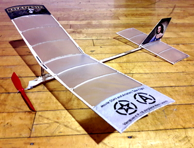

2D Flight Simulator
####################

I m an Aerospace Engineer and a Computer Scientist. I have spent almost 40
years working professionally in those fields, and have recently retired (for
the second time!)

While I was still in high school, I competed in a variety of model aviation
events near my home and across the country. That hobby was my motivation for
becoming an Aerospace Engineering student at Virginia Tech, and then an officer
in the USAF. After I finished my 20 year career in the Air Force, I stared a
second career as a Professor of Computer Science at Austin Community College in
Austin, Texas.

I was pretty busy during that time, and hardly put any time into hobbies. Now
that I am fully retired, it is time to revisit them, and I started off by
building a simple rubber-powered model I could fly in a local auditorium. 

The  markings on the model enable it to fly in the `Heart of America
Free Flight Association`_  "Stars and Aviators" mass launch event.

The model is a Vanguard P-18 kit from `Laser-Cut Planes`_.

..  _Laser-Cut Planes:  https://lasercutplanes.com/

Building it took all of one long evening, with some help from fellow club
member Jeff Nisley when it was time to cover the model with tissue.

Triming
*******

..  _Heart of America Free Flight Association:  http://flyhaffa.com/

Building a model airplane is just the starting point. iThe kit provided a few
guidelines on how to put the gadget together, but in the end you have to make
it fly. This kind of model uses a wound-up rubber band to drive the propeller.
It is launched and is completely on its own after that. First flights can be a
disaster. However, they provide clues as to what must change to get the model
to fly properly.

My model flew fairly well on very low power right from the start. But as I
increased the number of winds on the rubber motor, it started to dive toward
the ground. There were several things I could do to try to fix that, and this
project grew out of that adventure in experimental aircraft adjusting.

References
**********

Here are some references I used to work through building this simulator.

Introduction to Aircraft Flight Dynamics
========================================

* Robert Stengel
* Princeton University
* http://www.stengel.mycpanel.princeton.edu/AFDVirTex.html
